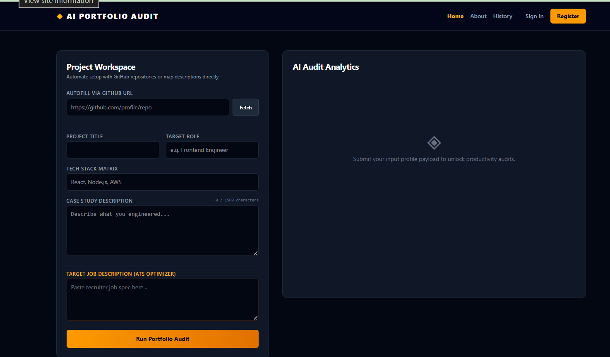

# ◈ AI Portfolio Audit System



An automated, developer-focused workspace built to refactor software engineering project summaries, analyze repository structures, and optimize impact descriptions to align perfectly against technical recruiter criteria and modern Applicant Tracking Systems (ATS).

---

## 🚀 Core Features

*   **Automated GitHub Parsing:** Instantly pulls project names, descriptions, and technology keywords straight from public GitHub repositories using structured parsing pipelines.
*   **ATS Keyword Gap Extraction:** Cross-references user summaries against real-world target job descriptions to identify missing tools, cloud frameworks, and methodologies.
*   **Quantitative Impact Scoring:** Evaluates project narrative descriptions and provides an objective **Impact Score (0-100)** based on metric-driven engineering principles.
*   **One-Click Workspace Synchronization:** Generates production-ready, STAR-method bullets that can be appended directly back into the live workspace canvas with a single click.
*   **Session History Persistence:** Dynamically tracks and logs previous audit scores, targets, and evaluation dates in an easily reviewable log panel.

---

## 🛠️ Tech Stack Matrix

| Layer | Technologies Used |
| :--- | :--- |
| **Frontend** | React, Vite, Tailwind CSS, JavaScript |
| **Backend** | Node.js, Express.js, OpenAI API SDK, Cors |
| **Tooling** | Git, npm, Postman |

---

## 📂 Local Installation & Setup

### Prerequisites
* **Node.js:** v24.0.0 or higher (required for native fetch architecture)

### 1. Clone the Repository
```bash
git clone [https://github.com/ayubsoaliha-SS/Al.audit.git](https://github.com/ayubsoaliha-SS/Al.audit.git)
cd Al.audit
2. Configure the Backend Service
cd backend
npm install

Create a .env file inside the backend/ folder:

Code snippet
PORT=5000
OPENAI_API_KEY=your_actual_openai_api_key_here

npm start

3. Configure the Frontend User Interface
Bash
cd frontend
npm install
npm run dev


